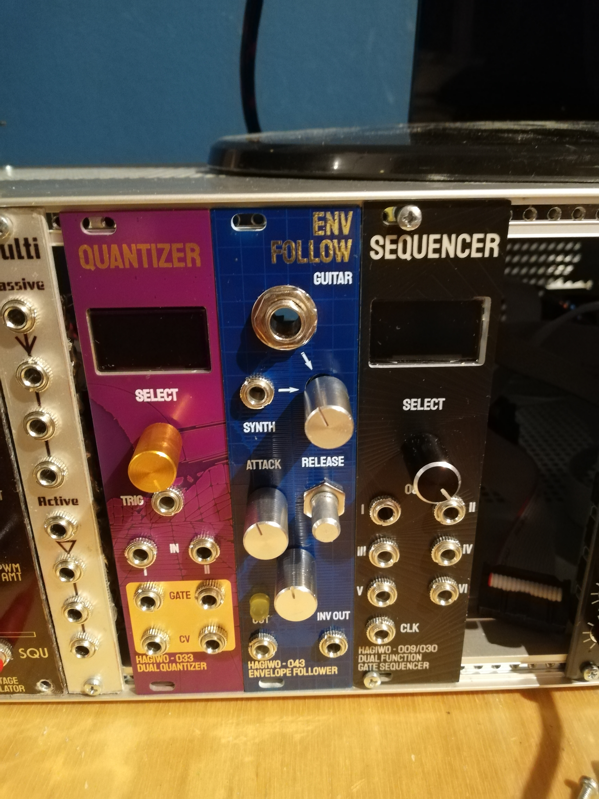
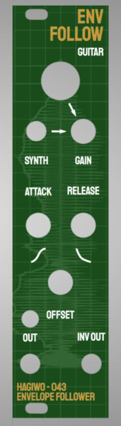
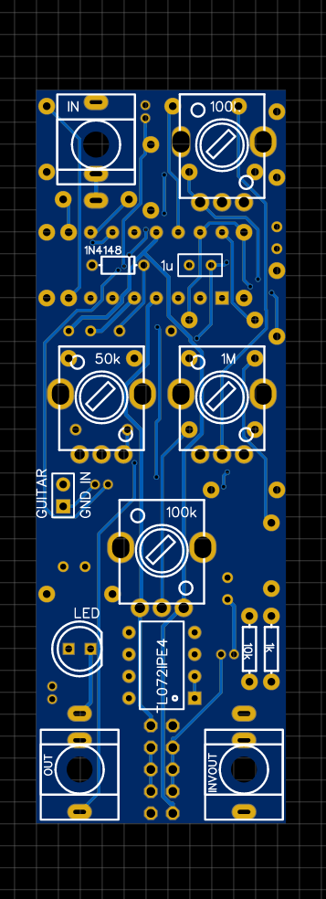
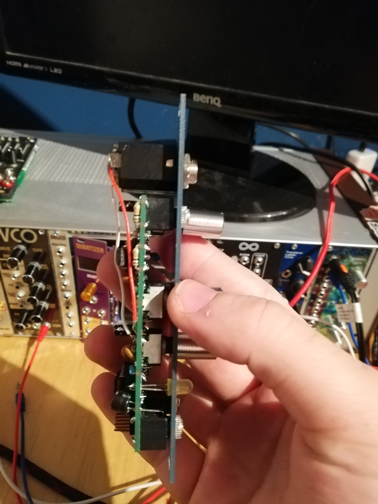
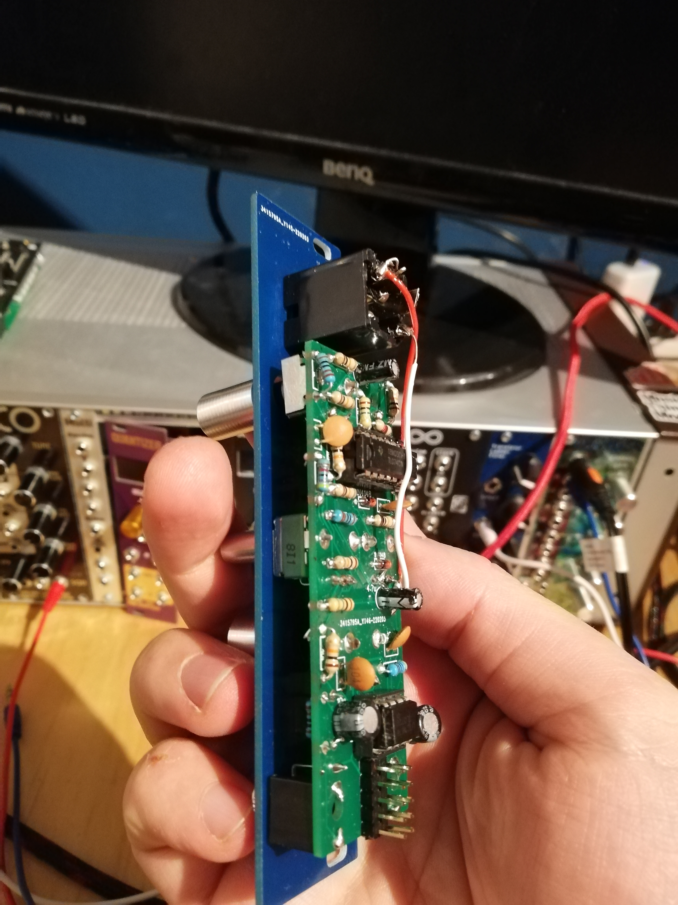

# Hagiwo Eurorack Envelope Follower

This project is a through hole PCB version the HAGIWO 043 envelope follower. I also added a guitar jack input with more amplification to be able to plug in a variety of instruments.

## STATUS: NEW VERSION FIXES PREVIOUS SMALL ISSUES WITH GUITAR JACK ORIENTATION. IF YOU HAVE THE OLD VERSION, COMPARE YOUR PCB WITH THE SCHEMATIC.

## Hardware and PCB
For this one I wanted to fit it all onto one PCB and make the guitar jack fit. This was quite a task and I'm afraid the pcb ended up a bit messy in the end because of this. It still works fine, but has a lot of overlapping components and you have to be careful when building it.

You can find the schematic and BOM in the root folder. 
For the PCBs, the module has one circuit PCB and one panel PCB. 
You can order them on any common PCB manufacturing service, I used JLCPCB. For the circuit PCB, standard settings should be fine.
For the panel, since it has copper exposed, make sure to choose a lead free surface finish (LeadFree HASL, ENIG) and/or spraypaint your panels so that you don't get lead on your hands.

 

For assembly, the guitar jack is optional. It will stick out and has to be connected to the rest of the pcb via wires. Look for the pads named "guitar in" and "gnd" on the pcb and connect those to the inner and outer log of a mono guitar/6.5mm jack socket.
Be sure to get a pcb mount guitar jack! we will not be mounting it to the pcb but the ["normal" round ones](https://www.conrad.de/de/p/bkl-electronic-1109001-klinken-steckverbinder-6-35-mm-buchse-einbau-vertikal-polzahl-num-2-mono-silber-1-st-732931.html) don't fit the spacing. I got [this!](https://www.reichelt.de/klinkeneinbaubuchse-6-3-mm-mono-2-pol-ebmsv-63-p36198.html?PROVID=2788&gclid=CjwKCAiAsNKQBhAPEiwAB-I5zdQuMwRXD1BioeI2tvVrd7EJKaeRaZpVK8cO38NI3ps_gF-faOb4TRoCZE0QAvD_BwE)

 
